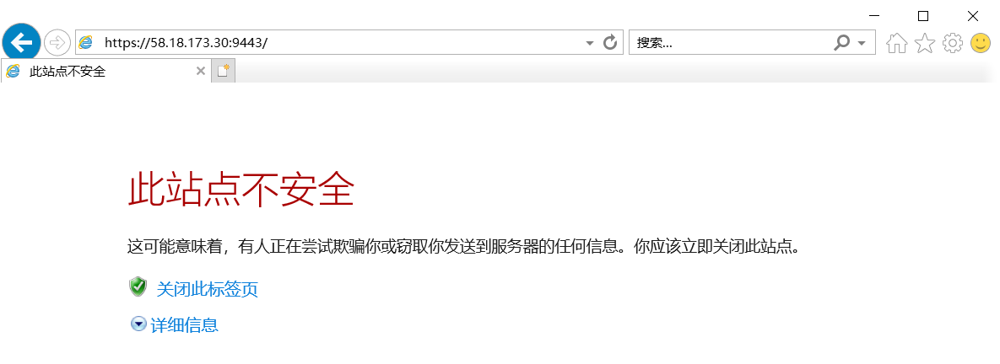
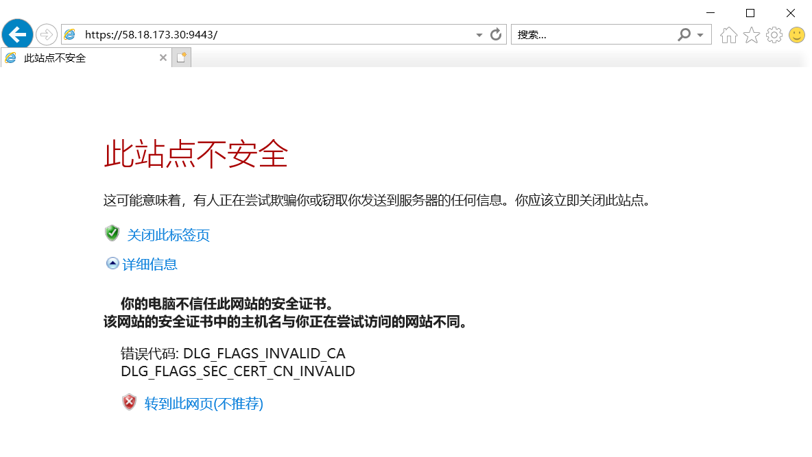
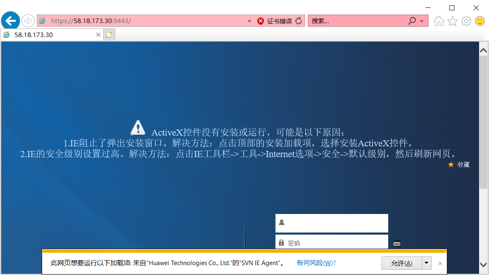
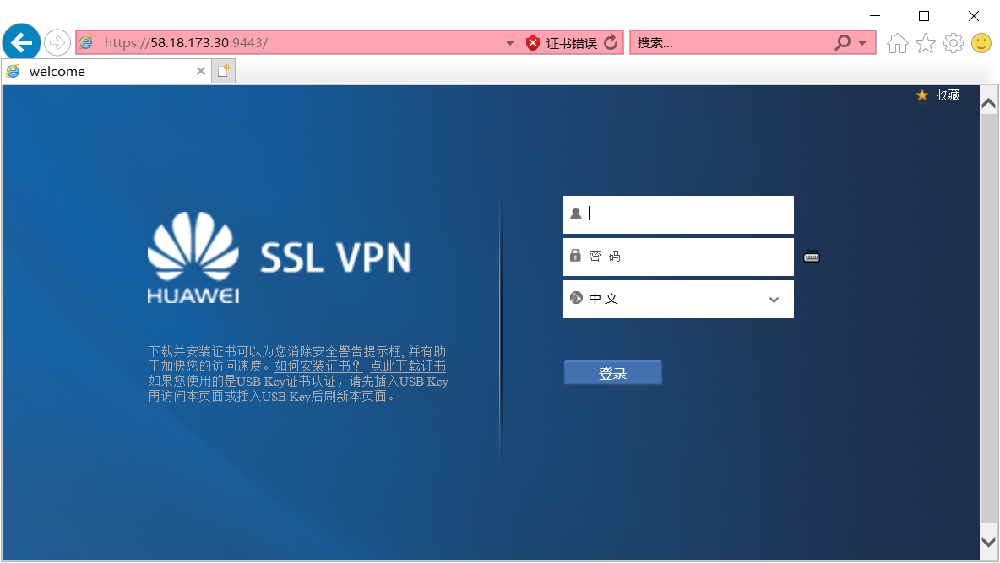

# 青城之光用户手册
## 1. 资源介绍
### 1.1. 青城之光
青城之光是由内蒙古自治区人民政府投资、自治区科技厅主管、清华大学设计、同方股份研制、在和林格尔新区建设的内蒙古高性能计算公共服务平台。  
TBD

### 1.2.
## 2. 帐号
青城之光作为一个高性能计算公共服务平台，面向各国科研院所及企事业单位提供领先的算力服务及支持。  
适用于包括气象、地理、制药、新材料研究、智慧农业、智慧工厂、智慧城市在内的各种科学应用。  

***注意： 禁止在青城之光平台上运行包括军事科研在内的涉密计算任务***
### 2.1. 账号说明
为了使用“青城之光”高性能计算公共服务平台，您需要：
1. Account账号，该账号是您在“青城之光”公共服务平台的主账号，也是计费账号，用于办理缴费充值等业务。您可以以单位的名义开通一个共同的Account账号，也可以按项目分别开通Account账号。  
2. User账号，该账号用于远程登录到“青城之光”公共服务平台的计算资源。User账号将与Account账号相关联，作为其子账号。  
3. VPN账号，您需要先通过VPN连接"青城之光"高性能计算公共服务平台，方可登录平台的计算资源。  

每个Account账号可以关联6个免费的User账号，额外的User账号需要按年收取账号服务费。  

### 2.2. 申请Accoun账号
要开通Account账号，请致电xxx-xxxxxxx与同方探索的销售代表联系。  
### 2.4. 开通User账号  
要登录并“青城之光”公共服务平台的计算资源，您需要为您项目组成员申请开通User账号，申请的方式有如下几种：  
1. 通过联系销售代表开通，平台管理员在为您开通User账号后会将账号初始密码告知销售代表，并由销售代表转交给您。  
2. 使用您预留的与Account账号关联的邮箱发送邮件到account@imhpc.com邮箱，平台管理员在为您开通User账号后会将账号初始密码以邮件形式发送给您。  

User账号的格式为xxx_yyyy，其中xxx字段为您的Account账号，yyyy字段您可以自行定义，但该字段不能有违公序良俗或带政治色彩。  
### 2.3.3 开通VPN账号  
通常VPN账号与User账号同名，且具有相同的初始密码。   
## 3. 登录  
### 3.1. VPN登录  
VPN登录支持浏览器及客户端两种方式登录,根据自己的实际情况任选一种即可。  
#### 3.1.1. 通过浏览器登录  
浏览器登录的方式仅适用于Windows环境下通过IE浏览器进行登录 。  
在浏览器地址栏中输入：  https://58.18.173.30:9443  
  
在站点安全性提示时，点击详细信息  
  
点击转到此网页  
  
点击下方风险提示栏中的允许按钮  
  
输入用户名及密码后，点击登录按钮即可成VPN登录。  
#### 3.1.2 通过secoclient客户端登录  
1. 下载客户端  
请使用百度网盘下载客户端软件secoclient  
[点击此处 百度网盘](https://pan.baidu.com/s/1PqmEYBZn_u2RTp9uD2fUtQ "SecoClient百度网盘地址")  
提取码：zk8c  
2. 安装客户端  
$\color{blue}{Windows客户端安装：}$双击下载来的secoclient安装程序根据程序提示进行安装即可。  
$\color{blue}{Linux客户端安装：}$Linux客户端安装需要root权限，具体方法为：
1)赋予下载来的安装程序以可执行权限  
```bash
[root@host Downloads]# chmod +x secoclient-linux-64-7.0.2.33.run  
```  

2)执行安装程序，并按相关提示完成安装
[root@host Downloads]# ./secoclient-linux-64-7.0.2.33.run                          
4. 
## 4. 数据传输  
## 5. 作业  
## 6. 软件  
